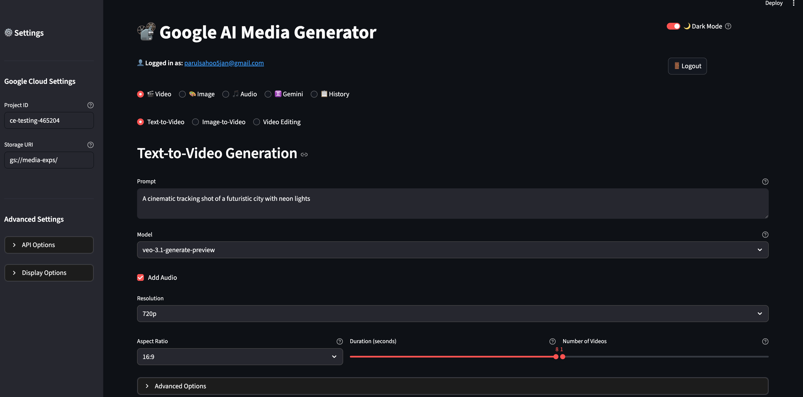

# AI Media Generation Interface

This application provides a streamlined interface for generating different typesd of media content using Google's in-house AI models. The Streamlit web application has the following features:



## Features

- **Text-to-Video Generation**: Create videos from text prompts with customizable parameters using Veo 3 and Veo 2.
- **Image-to-Video Generation**: Transform images into videos with style and motion having the option to choose from Veo 3 and Veo 2.
- **AI-Powered Prompt Generation**: Get prompt suggestions from AI to kickstart your creativity
- **Direct Video Streaming**: Preview and download generated videos directly in the app
- **Text-to-Image Generation**: Create images from text prompts using Imagen 3 and Imagen 4
- **Image-to-Image Generation**: Transform images using Nano Banana also known as Gemini 2.5 Flash Image Preview
- **Text-to-Audio Generation**: Generate music from text prompts
- **Text-to-Voice Generation**: Create speech from text prompts, with multiple voice options and script templates along with Gemini Flash and Pro model versions
- **Direct Audio Streaming**: Preview and download generated audio directly in the app
- **Video Editing**: Concatenate videos, alter playback speed, perform frame interpolation and Dubbing in Indic and international languages.
- **Complete History Tracking**: View and reuse previous generations with pagination support
- **Full Prompt Access**: View and copy the complete parameters for any generation
- **Customizable Settings**: Configure API keys, storage locations, and generation parameters
- **Responsive UI**: Works well on desktop and mobile devices
- **Pagination**: History shows 10 items per page for better performance
- **Full Prompt Access**: View and copy complete generation parameters
- **Video Size Optimization**: Videos properly fit within screen limits, even on large monitors
- **Quick Navigation**: Improved UI for easier access to key features
- **Enhanced Error Reporting**: Better feedback when issues occur

## Installation

1. Clone this repository:
   ```
   git clone https://github.com/anchit-nishant/Google-AI-media-gen.git
   cd Google-AI-media-gen
   ```

2. Install the required dependencies:
   ```
   pip install -r requirements.txt
   ```

3. Set up your Google Cloud environment:
   - Create or select a Google Cloud project
   - Enable the necessary APIs: Vertex AI, Cloud Storage, and Cloud Firestore, Cloud Build, Cloud Run and Artifact Registry.
   - Create a Firestore database in Native mode. Use that database ID in `.env` file.
   - Authenticate with `gcloud auth application-default login`

4. Configure your environment variables (in a `.env` file or directly):
   ```
   PROJECT_ID=your-google-cloud-project-id
   BUCKET_URI=gs://your-bucket-name/
   GEMINI_API_KEY=your-ai-studi-key-for-gemini-tts
   DB_ID=your-firestore-database-id
   ```

5. Configure the project variables in the `cloudbuild.yaml` file

## Usage

1. Start the Streamlit app:
   ```
   streamlit run streamlit_app.py
   ```

2. **Local Development (Bypassing Authentication)**

   To speed up local development, you can bypass the Google Sign-In flow. Run the app with the `--no-auth` flag:
   ```bash
   streamlit run streamlit_app.py -- --no-auth
   ```
   This will automatically log you in as a default development user and take you directly to the main application interface.
   > **Note:** The double-dash (`--`) is required to separate Streamlit's arguments from your script's arguments.
   
2. The app will open in your browser (typically at http://localhost:8501)

3. Navigate between tabs for different features:
   - **Text to Video**: Generate videos from text prompts
   - **Image to Video**: Upload and transform images into videos
   - **Text To Audio**: Generate music from text prompts
   - **Text To Voice**: Create speech from text prompts
   - **Video Editing**: Concatenate and edit videos
   - **History**: View and reuse past generations (now with pagination for better performance)
   - **Settings**: Configure application parameters

## Configuration Parameters

The application supports various configuration options:

- **Project ID**: Your Google Cloud project identifier
- **Storage URI**: Google Cloud Storage bucket location for outputs
- **Aspect Ratio**: Choose between 16:9 (landscape) and 9:16 (portrait) videos
- **Sample Count**: Number of videos to generate per request (1-4)
- **Duration**: Video length in seconds (5-8 seconds)
- **Person Generation**: Control whether people can appear in videos

## Advanced Options

- **Negative Prompt**: Specify elements to exclude from generation
- **Seed**: Set for deterministic/reproducible generation
- **Enhance Prompt**: Use AI to improve your text prompts

## Troubleshooting

If you encounter issues:

1. **Authentication Problems**:
   - Make sure you're logged in with `gcloud auth application-default login`
   - Verify your project has the required APIs enabled

2. **Video Playback Issues**:
   - Check your browser's security settings for video playback
   - Try the "Open in new tab" option for direct access
   - Clear browser cache if videos don't update

3. **Generation Failures**:
   - Verify your prompt follows content guidelines
   - Check GCS bucket permissions
   - Examine the app logs for detailed error messages
   - Examine you have the right access to the Veo2/3, Lyria and Gemini TTS required for successfully executing these features